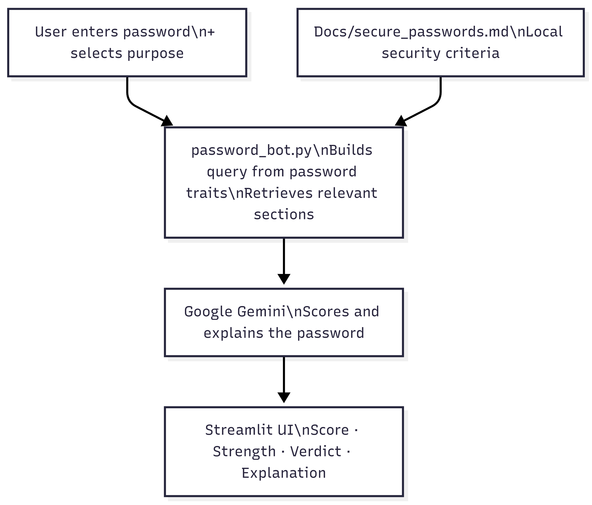
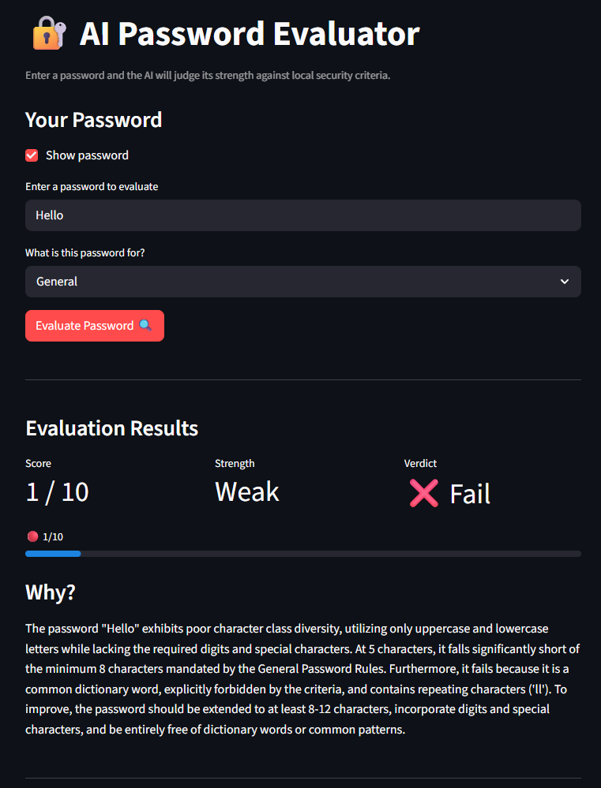
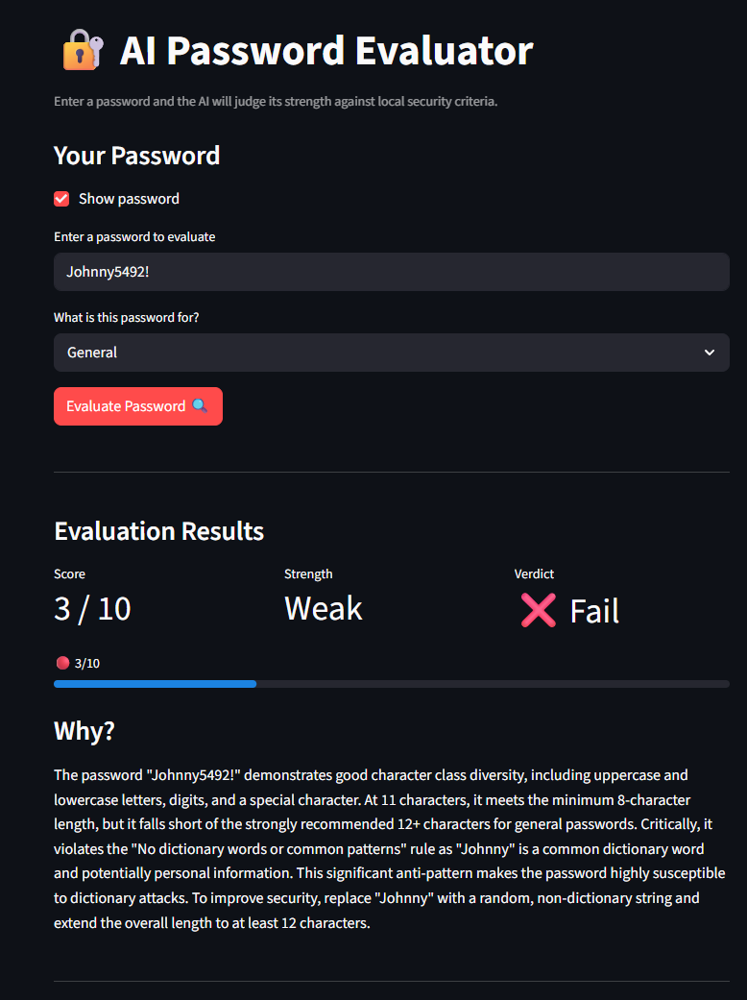

#Original Project- Game Glitch Investigator

The original game glitch investigator project was a number guessing game in which our goal was to identify problems with the application using AI and fix those issues with suggestions that AI made. We were to focus on evaluating the fixes that AI gives us and decide whether or not the AI fixes were to be implemented or not.

##Password Evaluator Grounded with RAG

The new program is a password evaluator that uses an LLM along with RAG to create a score and give feedback to the user on why the password is viable or not. RAG was done with a file that contains all the standards for a good password that can be updated anytime. This project is important because good passwords are needed for everyday secure operations through the internet.

###Architecture Overview



The program takes the input of the users desired password and the md file that contains all the standards for a good password. The password then goes through the password bot which uses an LLM to generate a score and a strength for the password based on the md password file. Finally, the LLM uses the md file to generate feedback to the user on the strengths and weaknesses of the password and the reason for the score.

####Setup

**Prerequisites:** Python 3.9 or higher must be installed on your machine.

**1. Clone the repository**

```bash
git clone https://github.com/JasonLiao118/applied-ai-system-project.git
cd applied-ai-system-project
```

**2. Install dependencies**

```bash
pip install -r requirements.txt
```

**3. Get a Gemini API key**

Go to [Google AI Studio](https://aistudio.google.com/app/apikey), sign in, and create a free API key.

**4. Configure your API key**

Copy the example environment file and add your key:

```bash
cp .env.example .env
```

Open `.env` in any text editor and replace `your_gemini_api_key_here` with your actual key:

```
GEMINI_API_KEY=
```

**5. Run the app**

```bash
streamlit run app.py
```

#####Sample Input Output





######Design Decisions

Building a password scorer with not only an LLM but RAG allows the password to be judged based off of user criteria as well and not just criteria that AI decides. In the app itself, there is a dropdown menu for the purpose of the password. The reason for this is that passwords take multiple different forms and we don't want the same strict criteria for all passwords. For example, some PIN numbers cannot have letters or symbols, so the criteria will not affect that specific scenario.

#######Testing Summary

The part where user testing and human verification is needed the most is when the program outputs a score and AI provides an explanation for the score and provides feedback. Through all my testing, the LLM provides a solid explanation on the score and does in fact refer back to the password rules md file like it is intended to do. I learned that especially for a program that makes decisions on security like a password, we really want to include RAG to make sure that AI does not make up its own rules for password security and we are able to evaluate passwords in situations that we want that we can change in our md file.

########Reflection

Throughout this project, AI was mainly utilized to help develop the app.py UI through streamlit. All the logic and design for this program and all the password rules in md were decided by me however. I did not want AI to decide the rules for password security. When I first suggested this project to AI, it thought I wanted code for a password generator instead of a password evaluator given the password rules md file. I had to keep correcting it's path to make sure it does not create logic I did not want. The system could be evolved further by expanding the secure_passwords md file for the password rules to evaluate passwords in other situations that might not be so common. There is also a large system security issue where it is possible for the user to inject commands into the system and security measures are needed to prevent injection.

#########Link to Demo

https://www.loom.com/share/066e0709042c4b6ea97e120e1a0f6290
